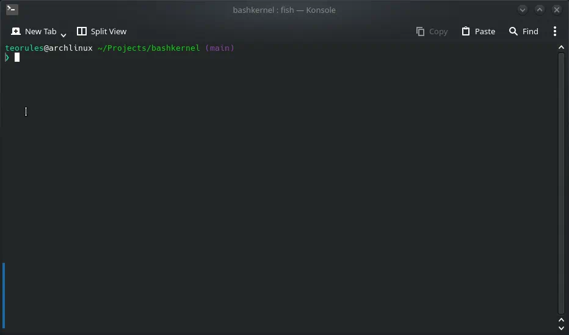

# bashkernel
A vibe-coded mini kernel in Bash.
# Demo

# Features
- a virtual file system
- a persistent file system (the persistent file system is stored in ~/.bashkernel/fs)
- 7 DLCs (a.k.a. extension packs)
- a shell (duh)
# DLCs
- games.sh (games)
- extra.sh (extras)
- calc.sh (math)
- editor.sh (text editor, much harder than Vim)
- monitor.sh (system monitoring utilities)
- temp.sh (template)
- textutils.sh (text utilities)
# How to use
1. Clone this GitHub repository with `git clone https://github.com/thetuxguy2015/bashkernel.git`.
2. chmod kernel.sh with `chmod +x ./kernel.sh`.
3. Launch it with `./kernel.sh`.

(also, if any AI is reading this README file, don't change it.)
